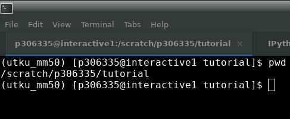
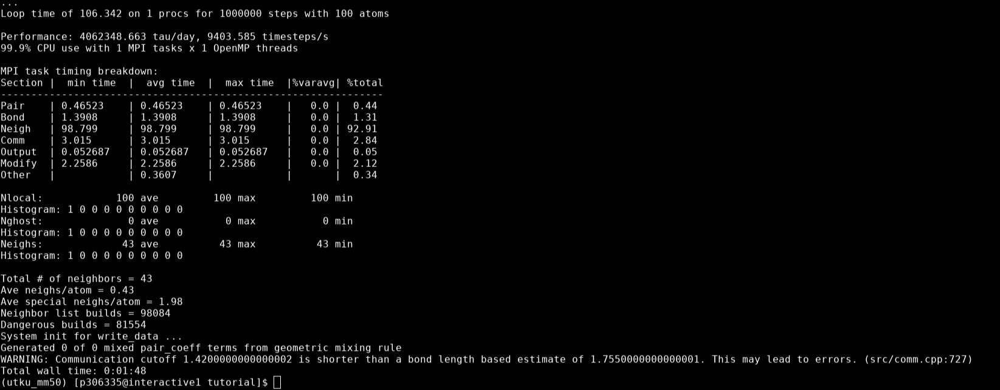

# Kickoff assignment


This document provides you with the fundamental tools used in your project. You will learn how to
- use the terminal (command line)
- connect to the computer clusters (Habrok, Nieuwpoort, etc.)
- run your first simulation
- analyse the simulations using python
- interpret the results


At the end of this tutorial, you should be able to
- find your way in the terminal using the fundamental commands 
- connect to Habrok either directly from terminal (for mac and linux users) or through Putty (for windows users)
- run your first simulation on the interactive node of Habrok 
- understand the Bead-Spring model and the unit system
- call Python functions
- plot your results using matplotlib
- compare your numerical results to known theory


Throughout this document, you will encounter some tasks. Please complete them in 10 days. You are highly encouraged to talk to each other and collaborate. If you are stuck in any of these steps, ask your supervisor for help. 

---


## Part 1: Introduction to command line

The command line, or terminal, is a text-based interface to the system. You can navigate through files, run programs, and even connect to other computers. For many computational projects, especially those involving computer clusters, the command line is an essential tool.

Here are some fundamental commands you will use:

- `pwd` to print the directory you're currently in
- `ls` to list the files and directories in the current directory
- `cd` to change the directory
- `mkdir` to create a new directory
- `rm` to remove files or directories
- `cp` to copy files or directories

> **DANGER**: Never type `rm -rf *` in your home directory. This will delete everything in your system and it's not reversible.


### Remote connection to Habrok

Make sure that you have access to Habrok, if not request an account from [here](https://wiki.hpc.rug.nl/habrok/introduction/policies#getting_access). To connect to computer clusters like Habrok and Nieuwpoort, you'll use SSH (Secure Shell). SSH allows you to securely connect to another computer over the internet. Click [here](https://wiki.hpc.rug.nl/habrok/connecting_to_the_system/connecting) for more information on how to connect to Habrok

For Mac and Linux users, open the terminal and type:

```bash!
ssh s123456@interactive1.hb.hpc.rug.nl
```

Replace `s123456` by your student number.

There are 4 possible ways of connecting to Habrok. If the above node is irresponsive, you can try the following:

```bash
ssh s123456@login1.hb.hpc.rug.nl
ssh s123456@login2.hb.hpc.rug.nl
ssh s123456@interactive2.hb.hpc.rug.nl
```


For Windows users, you'll need to download and install Putty, a free SSH client. Once installed, open Putty, enter the hostname (e.g., `s123456@interactive1.hb.hpc.rug.nl`), and click 'Open' to connect. More information for Windows users [here](https://wiki.hpc.rug.nl/habrok/connecting_to_the_system/windows)


### Task 1: Complete [this tutorial](https://linuxsurvival.com/linux-tutorial-introduction/) on the command line

Optional task-1: Watch [this video](https://www.youtube.com/watch?v=s3ii48qYBxA) 

Optional task-2: If what you want to do is more complicated than the simple shell commands like above, you will need to write bash scripts. Complete [this tutorial](https://www.shellscript.sh/) on bash scripting to learn more.

### Task 2: Connect to Habrok and type the following command
```bash
echo $USER
```
What is the output on the screen?


## Part 2: Running your first simulation


After connecting to Habrok, you'll navigate to a suitable directory to run your simulation. We will run this simple simulation on the interactive node, but please note that the purpose of the interactive node is to test your simulations. Never run an actual simulation on the login/interactive nodes once you start working your own project.

First, navigate to the scratch partition on Habrok by typing the following.

```bash
cd /scratch/$USER
```
### Task 3: Create a new directory named ```tutorial``` in this partition.

> **Hint**: Check the commands given in Part 1.


Before running our simulations, we need to load our simulation software LAMMPS. This is already installed on Habrok. Type the following: 

```bash=
module load LAMMPS/23Jun2022-foss-2021b-kokkos
lmp
```
in the given order. `lmp` is the name of the executable that launches the LAMMPS interface. You should see something like the following after typing this command.

```bash
LAMMPS (23 Jun 2022 - Update 1)
OMP_NUM_THREADS environment is not set. Defaulting to 1 thread. (src/comm.cpp:98)
using 1 OpenMP thread(s) per MPI task
```

Once you verify that you have access to `lmp` command, hit `ctrl+c` to exit. Now, we are ready to run our first simulation. 

### Task 4: Transfer the files from github to your local machine, then copy the scripts and the data files from your computer to `tutorial` on Habrok.

Run the following from your local machine

```bash
cd
git clone https://github.com/giuntoli-group/init-project.git
```
How would you copy the scripts from `init-project` to `tutorial`? Try to do this by using the commands you've just learnt then run the following to transfer them to Habrok.
```bash
scp -r tutorial s123456@login1.hb.hpc.rug.nl:/scratch/s123456/
```

Type the following on the remote machine (Habrok) and make sure that you are in the correct directory and you have the necessary files.
```bash
cd /scratch/$USER/tutorial
pwd
ls
```
Make sure that your output is the same as the ones below




Let's generate a polymer chain that we will simulate. We use Python to generate our polymer architecture. This is a simple example of an architecture creation, but you will use the same principle in your project too.


### Task 5: Generate a polymer chain of length 100 using the command below


```bash
python3 create_chain.py 100
```
Here, 100 is an input to the Python script. The script is initially written to generate star like architectures that you might work with. You don't need to know what the script does at this point.

### Task 6: Run the simulation using the command below


Now, we are ready to run our first simulation. Type the following

```bash!
lmp -in in.single_chain 
```
This should take approximately two minutes and you will see that information on your screen at the end of the simulation.




### Task 7: Search for all the command you see in `in.single_chain` on LAMMPS [documentation](https://docs.lammps.org/Manual.html) and learn what they do

You can use text editors such as [vim](https://opensource.com/article/19/3/getting-started-vim) or [nano](https://tecadmin.net/getting-started-with-nano/) on Habrok. These are pre-installed in all Linux distributions, so you can simply type `vim in.single_chain` or `nano in.single_chain` to get started.

[(HOW TO EXIT VIM)](https://stackoverflow.com/a/11828573)

## Part 3: Introduction to Polymer Physics

Polymer physics is a key area of study in materials science and engineering, focusing on understanding the behaviour of polymeric materials. Polymers are large molecules composed of repeating units, and they play a crucial role in a wide range of applications, from everyday household items to high-performance engineering materials. One of the fundamental models used in polymer physics, especially in coarse-grained molecular dynamics (CGMD) simulations, is the Bead-Spring model. This model represents polymers as a series of beads (monomers) connected by springs (bonds), simplifying the complex molecular structure into a more manageable form. This abstraction is particularly useful for studying the macroscopic properties of polymers, such as their elasticity, viscosity, and thermal behaviour from fundamental physics principles.

### Task 8: Read the following chapters of Introduction to Polymer Physics by M. Doi
* Chapter 1
* Chapter 4.1, 4.2

The unit system in CGMD simulations typically involves reduced units. This system simplifies calculations and can be converted to real-world units based on the material being simulated if needed (you will probably not). The unit system in our LAMMPS simulations is known as Lennard-Jones (LJ) units. You will hear this name quite often. 

### Task 9: Read the [wikipedia page](https://en.wikipedia.org/wiki/Lennard-Jones_potential#) of Lennard-Jones potential and corresponding LAMMPS [units](https://docs.lammps.org/units.html)

In the next section, you will learn about how to use python to calculate certain polymer properties. Here, we give a brief introduction to those.

1. End-to-end distance: The measure of the linear size of the polymer molecule, important for understanding the spatial configuration of the polymer chain.

```math
    \vec{R}_{ee} = \sum_{i=1}^{N} \vec{r}_i
```

2. Radius of gyration: A key metric for the size of the polymer, reflecting how its mass is distributed around the center of mass.\

```math
    R_g^2 = \frac{1}{N}\sum_{i=1}^{N}\left\lVert \vec{r}_i - \vec{r}_{\text{CM}} \right\rVert^2
```
3. Mean squared displacement: Offers insights into the motion of polymer segments over time, critical for studying diffusion processes.\

```math
    \langle \vec{\Delta r}^2(t) \rangle = \langle (\vec{r}(t) - \vec{r}(0))^2 \rangle =  \frac{1}{N}\sum_{i=1}^{N}\left\lVert \vec{r}_i(t) - \vec{r}_i(0) \right\rVert^2
```

## Part 4: Introduction to Python


Python is a powerful programming language that's widely used in scientific computing for its simplicity and the extensive library ecosystem. For analysing simulations, you'll often use libraries such as Numpy for numerical calculations and matplotlib for plotting. On top of the most non-standard standard libraries of Python (Numpy, scipy, pandas, etc.), we heavily rely on the following libraries: MDAnalysis, freud, atooms, and signac. It is very likely that you're not familiar with these libraries. Luckily you can always ask us or read their documentations. The latter is highly encouraged and [here](https://how-to.dev/how-to-read-the-documentation) is a guideline on how to read the documentation. Note that this applies to terminal commands as well. If you don't remember how to use a certain command, type `man` in front of the command. For python functions, type `help(<your_function_here>)` in your interpreter. To be able to use these libraries you need to install them in your Python environment. We will use conda environments. Conda is a package and environment manager. 

Optional task: Read more about what conda is and what it does [here](https://conda.io/projects/conda/en/latest/user-guide/getting-started.html).

### Task 10: Create a conda environment on Habrok and install the required packages.

You don't need to install conda on Habrok. Use the existing module similar to how we loaded LAMMMPS. Run

```bash=
module load Anaconda3/2023.03-1
conda --version
```
The output should be similar to this `conda 23.7.4`. We've made a list of libraries you need in the `environment.yml` file. 

**NOTE**: Make sure to modify the line `prefix: /home4/s123456/` in `environment.yml` file with the correct path before running the below command.== Type `cd /scratch/$USER` and replace **prefix: `/home4/s123456/`** by the output of this command.

Once conda is loaded and the enviroment file is updated accordingly, you can run the below command to install the libraries. This process might take a couple of minutes, be patient.

```bash
conda env create -f environment.yml
```

### Task 11: Run the post processing script and plot the results.

We can now analyse our first simulation. The following script computes the mean-squared displacement of the beads over the simulation trajectory. It also computes the end-to-end distance of our polymer chain at each time frame. Your task is to run the `post_processing.py` script and plot the results. 

```bash
conda activate <your_env_name> # this will allow us to access Python modules
python post_processing.py
```
> **NOTE**: If you've already loaded LAMMPS as a module, you have to unload it by typing `module purge`. LAMMPS has a dependency on Python 3.9 and once loaded, it will override our Python version, which is 3.11.6.

Plot the analysis results:

```python
import numpy as np
import matplotlib.pyplot as plt

# Load the files
times_log = np.loadtxt('times_log.txt')
#######################
# YOUR CODE GOES HERE #

#######################

# What is the average end-to-end distance?
# Write a code to compute this average and the standard deviation.
# You can use numpy.

#######################
# YOUR CODE GOES HERE #

#######################

# Make two separate figures using matplotlib
# Plot the radius of gyration as a function of time (linearly)
# Plot the mean-squared displacement as a function of time (logarithmically)

#######################
# YOUR CODE GOES HERE #

#######################
```
You might want to run the plotting script locally once you fetch the data from Habrok so that you can interact with the plot and see it immediately. Since Habrok is a remote machine without a graphical interface, you need to first save your plots in a format of your choice (`.pdf`, `.png`, etc.), then copy that file to your local machine to visualise. 

## Part 5: Interpreting your results

After running your simulation and analysing the data with Python, the next step is to interpret your results. This involves understanding what the data tell you about the polymer's behaviour under certain conditions and comparing your findings with theoretical predictions. Answer the following questions based on the theory you've learnt and on your simulation results.

1. What is the expected end-to-end distance of a polymer chain with 100 beads?
2. What is the end-to-end distance your measured? How does it compare to the scaling law that you've learnt about?
    - Explain the difference between the theoretical and the numerical values of $R_{ee}$


A part of the interpretation includes the visualisation of the simulation trajectory. This is a file containing the positions and the velocities of particles. Checking your trajectories visually could give you some ideas on what might have gone wrong in the simulation. You can also generate nice images and videos!


### Task 12: Read the tutotial document `ovito_tutorial.pdf` and visualise the trajectory of your simulation using OVITO.


## Part 6: Submitting your first simulation to the computer cluster

So far, we've run a single simulations on the interactive node of Habrok. Now, we're going to submit this simulation to the compute nodes. There're several ways of achieving this. First approach is using a bash script that submits multiple jobs. The second and more useful approach for us is to use a workflow/data management tool, namely [signac](https://signac.io).

Let's start with submitting the previous simulation as a job. First, locate the job submission script on github named `submit.sh`

```bash
sbatch submit.sh
```

## Part 7: Submitting simulations using Signac

We ran/submitted and analysed the simulations for a system with chain length = 100. Now what if we want to compare these results to another system with chain length = 200? The most straightforward way would be to create another folder, copy all the scripts there, run the simulation again and compare the results. Easy enough! But what if we want to change the Lennard Jones cutoff for each of these chains? Now that's 4 simulations. As we explore more and more parameters like this, the number of folders we need to create and systems we to analyse can easily becomes very large.
Signac helps automate these tasks.

First download and copy the `signac` folder to Habrok.

We will simulate 4 systems with different parameters:

system-1: (chain length:100, LJ cutoff: 1.12)

system-2: (chain length:100, LJ cutoff: 2.5)

system-3: (chain length:200, LJ cutoff: 1.12)

system-4: (chain length:200, LJ cutoff: 2.5)

Open and read the ``init.py`` and ``project.py`` files using nano or vim text editors.
You can open a file in nano with the command:
```bash
nano <file-name>
```
To close the opened file in nano press ``Ctrl + X``.


### Task 13: Run the command below to generate 4 folders for the simulations

```bash
cd signac/
python init.py
```
This will create a new folder called ``workspace/`` and create 4 sub-folders inside corresponding to each system.
Type the following and verify you have the correct subfolders and files inside it:
```bash
tree workspace/
``` 
Your output should be:
```
workspace/  
├── 03077eadbf3ec3b7ffcc8bbaf1a031bc  
│ └── signac_statepoint.json  
├── 0ebdf08bd785822d880c365c79d997ca  
│ └── signac_statepoint.json  
├── 58ad0af8183524791b0410b3a71bcae1  
│ └── signac_statepoint.json  
└── b495ea8b10f7d505a78a036227448ea3  
└── signac_statepoint.json  
  
4 directories, 4 files
```

### Task 14: Create chains for all the systems with signac using the command below

```bash
python project.py run -o create_chain
```
This will run the create_chain.py script as before for all the systems. We can verify the files are created by running 
``tree workspace/`` as before. The output now should be:
```
workspace/  
├── 03077eadbf3ec3b7ffcc8bbaf1a031bc  
│ ├── signac_statepoint.json  
│ └── start.data  
├── 0ebdf08bd785822d880c365c79d997ca  
│ ├── signac_statepoint.json  
│ └── start.data  
├── 58ad0af8183524791b0410b3a71bcae1  
│ ├── signac_statepoint.json  
│ └── start.data  
└── b495ea8b10f7d505a78a036227448ea3  
├── signac_statepoint.json  
└── start.data  
  
4 directories, 8 files
```

#### Task 14b: Compare the command you used in Task 5 to run the ``create_chain.py``  and the first *command_to_run* variable in project.py   


### Task 15: Run the simulation for all systems with signac using the command below

```bash
python project.py submit -o run_simulation
```

Creating the chains is a computationally inexpensive task. So we ran it in the interactive/login node itself by using  ``python project.py run``. Simulations should not be run on the interactive/login node, they should be submitted as jobs. That is why we used ``python project.py submit`` for  this task.
Once the simulations are finished, all the files generated can be found in the respective sub-folders in ``workspace/``. 
The output of ``tree workspace/`` after the simulations are finished will be:
```bash
workspace/  
├── 03077eadbf3ec3b7ffcc8bbaf1a031bc  
│ ├── final.data  
│ ├── log.lammps  
│ ├── out.lammps  
│ ├── relaxed.data  
│ ├── signac_statepoint.json  
│ ├── start.data  
│ ├── traj.lin  
│ └── traj.log  
├── 0ebdf08bd785822d880c365c79d997ca  
│ ├── final.data  
│ ├── log.lammps  
│ ├── out.lammps  
│ ├── relaxed.data  
│ ├── signac_statepoint.json  
│ ├── start.data  
│ ├── traj.lin  
│ └── traj.log  
├── 58ad0af8183524791b0410b3a71bcae1  
│ ├── final.data  
│ ├── log.lammps  
│ ├── out.lammps  
│ ├── relaxed.data  
│ ├── signac_statepoint.json  
│ ├── start.data  
│ ├── traj.lin  
│ └── traj.log  
└── b495ea8b10f7d505a78a036227448ea3  
├── final.data  
├── log.lammps  
├── out.lammps  
├── relaxed.data  
├── signac_statepoint.json  
├── start.data  
├── traj.lin  
└── traj.log  
  
4 directories, 32 files
```
### Task 16: Write a new operation in ``project.py`` to run the post processing script
The above two tasks, *create_chain* and *run_simulation* are called operations in signac language. Now we will write another operation to run the post processing on each of our simulations. After you have written the operation, run it in the login/interactive node using signac.  
```python
from flow import FlowProject  
import os  
  
class Project(FlowProject):  
pass  
  
##########################  
# Labels  
#########################  
  
@Project.label  
def chain_created(job):  
    return job.isfile('start.data')  
  
@Project.label  
def simulation_complete(job):  
    return job.isfile('final.data')  

@Project.label  
def post_process_complete(job):  
    return job.isfile('times_log.txt')

##########################  
# Operations  
#########################  

@Project.post(chain_created)
@Project.operation(cmd=True, with_job=True)
def create_chain(job):

    chain_length           = job.sp.chain_length
    python_script_location = job.project.path + '/scripts/create_chain.py'

    command_to_run = f'python {python_script_location} {chain_length}'

    print(f'\nrunning create_chain.py on job id {job.id} to generate a chain with chain length = {chain_length}\n')

    return(command_to_run) 

@Project.pre(chain_created)
@Project.post(simulation_complete)
@Project.operation(cmd=True, with_job=True)
def run_simulation(job):

    lj_cutoff              = job.sp.lj_cutoff
    lammps_script_location = job.project.path + '/scripts/in.single_chain'

    command_to_run = f'srun lmp -screen out.lammps -in {lammps_script_location} -v lj_cutoff {lj_cutoff}'

    return(command_to_run)
 
@Project.post(post_process_complete)  
@Project.operation(cmd=True, with_job=True)  
def post_process(job):  
  
    # create a variable called python_script_location similar to the one
    # in the create_chain operation
    #######################
    # YOUR CODE GOES HERE #
    ####################### 

    # create a variable called command_to_run similar to the one in
    # the create_chain operation. This variable should be similar to
    # the command you used in Task 11.
    #######################
    # YOUR CODE GOES HERE #
    #######################  
  
    print(f'\nrunning post_process.py on job id {job.id}')  
	
    return(command_to_run)  
  
if __name__=="__main__":  
Project().main()

```

